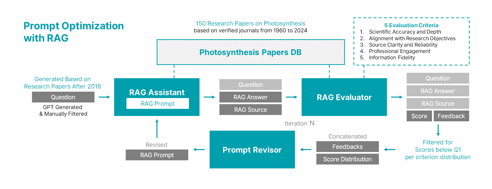

# Photosynthesis Research Assistant LLM

This repository contains the code and resources for the **Photosynthesis Research Assistant LLM** project. This project leverages Language Model (LLM) technology to assist in photosynthesis-related research, providing tools for question answering, document retrieval, prompt optimization, and more.

## Project Structure

The repository is organized into the following key folders and files:

### Folders

- **`core/`**  
  Implements the main functionality of the project:
  - **`prompt_optimization.py`**: Optimizes prompts for better LLM responses.
  - **`prompt_revision.py`**: Provides tools for revising and refining prompts.
  - **`rag_assistant.py`**: Implements the retrieval-augmented generation (RAG) assistant.
  - **`rag_evaluator.py`**: Evaluates the RAG assistant's performance.

- **`data/`**  
  Contains dataset files used for training and testing:
  - **`photosyn_qa_dataset.pickle`**: Main dataset of question-answer pairs related to photosynthesis.
  - **`photosyn_qa_prompt_history.pickle`**: Records prompt and response history for analysis.

- **`database/photosyn_papers_db/`**  
  A database with research papers on photosynthesis, stored in **ChromaDB** format.

- **`utils/`**  
  Holds utility modules and configuration files:
  - **`config.py`**: Contains essential parameters and settings, including API keys and data paths.
  - **`data_repository.py`**: Manages and accesses datasets and other resources.

### Files

- **`README.md`**: Provides an overview of the project and setup instructions.
- **`main_prompt_optimization.py`**: The main script for running prompt optimization tasks.
- **`notebook.ipynb`**: A Jupyter notebook with code examples and data analysis.
- **`streamlit_demo.py`**: Streamlit app to demonstrate the model's capabilities through a web interface.

## Instructions for User

### 1. Clone the repository

```bash
git clone https://github.com/LABA-SNU/photosyn_research_assist_llm.git
cd photosyn_research_assist_llm
```

### 2. Set up the API Key and Data Paths

Open `utils/config.py` and update the **API key** and **data paths** as needed.

- **API Key**: Replace `"your_openai_api_key_here"` with your actual OpenAI API key.
- **Data Paths**: The paths for `DATA_PATH` and `DB_DIRECTORY` are set relative to the project root directory by default. You can adjust them if your data or database directories are in a different location.

```python
# utils/config.py

import os

# API Key Configuration
OPENAI_API_KEY = "your_openai_api_key_here"  # Replace with your OpenAI API key
os.environ["OPENAI_API_KEY"] = OPENAI_API_KEY

# Base directory (automatically set to the directory containing config.py)
BASE_DIR = os.path.dirname(os.path.dirname(os.path.abspath(__file__)))

# Paths relative to BASE_DIR
DATA_PATH = os.path.join(BASE_DIR, "data")  # Modify if data directory is elsewhere
DB_DIRECTORY = os.path.join(BASE_DIR, "database/photosyn_papers_db")  # Modify if database directory is elsewhere
MODEL_NAME = "gpt-4o"  # or 'gpt-3.5-turbo', etc.
```

### 3. Run main script: 
Execute the main script to start the prompt optimization process.

```bash
python main_prompt_optimization.py
```

### 4. Run the Streamlit demo: 
To view the demo of the Photosynthesis Research Assistant LLM in a web interface, run:
```bash
streamlit run streamlit_demo.py
```
